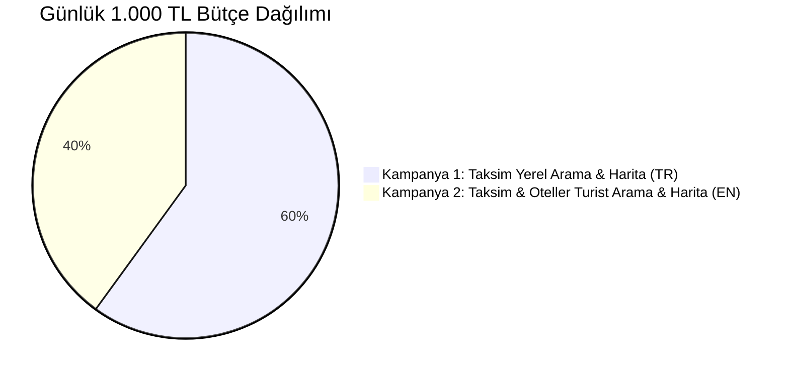

# Tarihi Van Kahvaltı Evi 1978 — Google Ads Profesyonel Kurulum ve Strateji Rehberi (Güncel)

Bu belge, **günlük 1.000 TL bütçe** ile **kesinlikle YouTube reklamları, mobil oyun içi reklamlar ve uygulama banner'ları olmadan**, yalnızca **Google Arama Ağı** ve **Google Haritalar (Google Maps)** üzerinden dükkana müşteri çekecek profesyonel kampanya mimarisini içerir.

---

## 🛑 KESİN KURALLAR (SIFIR ÇÖP TRAFİK)

| İstenmeyen Kanallar (KAPALI / YASAK) | İstenen Kanallar (AÇIK / AKTİF) |
| :--- | :--- |
| ❌ **YouTube Reklamları** (Video & Banner) | ✅ **Google Arama Sonuçları** (*"taksim van kahvaltısı"*, *"best breakfast taksim"*) |
| ❌ **Mobil Oyun Reklamları** (Candy Crush, Subway Surfers vb.) | ✅ **Google Haritalar (Maps) Promoted PIN Reklamları** |
| ❌ **Uygulama İçi Banner'lar** (El feneri, hesap makinesi vb.) | ✅ **Google Haritalar Yerel Arama Sonuçları (Top 1)** |
| ❌ **Görüntülü Reklam Ağı (Display Network)** | ✅ **Doğrudan Yol Tarifi & Telefon Araması Butonları** |
| ❌ **Arama Ağı İş Ortakları (Search Partners)** | ✅ **Taksim & Çevresi 3.5 km Yarıçap Odaklı Trafik** |

---

## 💰 BÜTÇE DAĞILIMI (GÜNLÜK TOPLAM ₺1.000 TL)



* **Kampanya 1 (Yerli - TR):** **₺600 / gün** (Taksim, Beyoğlu, Cihangir, Şişli, Beşiktaş).
* **Kampanya 2 (Turist - EN):** **₺400 / gün** (Taksim & Sultanahmet otellerindeki yabancılar).
* **Aylık Toplam:** ~₺30.000 TL *(Eski sistemde 46.000 TL çöpe gidiyordu; artık 30.000 TL'nin tamamı dükkana müşteri olarak dönüyor).*

---

## 📍 GOOGLE HARİTALAR (MAPS) REKLAMI NASIL ÇALIŞIYOR?

1. **Google İşletme Profili (Google Business Profile) Entegrasyonu:**
   - Hesabınızda `Tarihi Van Kahvaltı Evi 1978` (Zambak Sk. No:8) profili **Konum Öğesi (Location Asset)** olarak bağlıdır.
2. **Harita Üzerinde Öne Çıkma (Promoted Pin & Top Listing):**
   - Kullanıcı Google Haritalar'da *"kahvaltı"*, *"van kahvaltı evi"*, *"breakfast"* yazdığında veya Taksim çevresinde haritayı gezerken dükkanınız **Mor Renkli Öne Çıkan PIN** ve en üst sıradaki sponsorlu mekan olarak listelenir.
   - Kullanıcı doğrudan **"Yol Tarifi Al"** ve **"Ara"** butonlarıyla dükkana gelir.
3. **Sıfır Video / Oyun Riski:**
   - Arama Ağı + Konum Uzantısı modeli kullanıldığı için reklamlarınız **asla YouTube'da veya oyunlarda çıkmaz**; yalnızca Google Arama ve Google Haritalar arayüzünde görünür.

---

## 🚫 HESAP DÜZEYİNDE NEGATİF ANAHTAR KELİME LİSTESİ (200+ KELİME)

Aşağıdaki kelimeler bütçenizi korumak için hesap genelinde negatife alınmıştır:

### A. Şehir / Ulaşım / Coğrafi Karışıklıklar
```text
van otobüs bileti
van uçak bileti
van otelleri
van pansiyon
van gölü
van kedisi
van kalesi
van ekspresi
van ferit melen havalimanı
van valiliği
van belediyesi
van üniversitesi
van yüzüncü yıl
van hava durumu
van harita
van kiralık daire
van satılık ev
van haberleri
van nöbetçi eczane
van otogarı
van merkez
van edremit
van ipekyolu
van tuşba
van erciş
van başkale
van muradiye
van özalp
van saray
van çaldıran
van bahçesaray
van gürpınar
van çatak
```

### B. Uzak İlçeler / Şehir Dışı
```text
kadıköy
anadolu yakası
üsküdar
kartal
maltepe
pendik
tuzla
ataşehir
ümraniye
çekmeköy
beykoz
şile
sancaktepe
sultanbeyli
bakırköy
florya
yeşilköy
avcılar
beylikdüzü
esenyurt
büyükçekmece
küçükçekmece
başakşehir
bağcılar
bahçelievler
güngören
zeytinburnu
esenler
bayrampaşa
gaziosmanpaşa
sultangazi
eyüpsultan
sarıyer
arnavutköy
çatalca
silivri
izmir
ankara
bursa
antalya
eskişehir
adana
trabzon
kocaeli
sakarya
tekirdağ
edirne
```

### C. Tarif & Evde Yapım & Alakasız
```text
tarifi
tarifleri
nasıl yapılır
nasıl pişirilir
evde yapımı
malzemeleri
içindekiler
kalori
faydaları
zararları
tarihçesi
nedir
kimdir
vikipedi
wikipedia
ekşi sözlük
youtube
video izle
fotoğrafları indir
resimleri
çizimi
vektörel
png
logo
vektör
iş ilanları
iş başvurusu
garson arayanlar
komi arayanlar
aşçı arayanlar
eleman arayanlar
maaşları
iş başvurusu yap
franchise
bayilik
devren satılık
kiralık
sahibinden
toptan
bayilik şartları
```

---

## 🇹🇷 1. KAMPANYA: Taksim & Çevresi Yerel Arama ve Harita (TR)

* **Kampanya Türü:** Sadece Arama Ağı (Search)
* **Ağlar:** Google Arama Ağı (Görüntülü Ağ: **KAPALI**, Arama Ortakları: **KAPALI**)
* **Günlük Bütçe:** **₺600,00 / gün**
* **Hedef Konum:** Zambak Sk. No:8 merkezli **3.5 km yarıçap** (Beyoğlu, Cihangir, Şişli, Beşiktaş, Karaköy)
* **Zaman Planı:** Pazartesi - Pazar: `07:30 – 16:30`
* **Teklif Stratejisi:** Tıklama Sayısını En Üst Düzeye Çıkarma (Maks. TBM Sınırı: ₺12,00)

### Anahtar Kelimeler
```text
[taksim van kahvaltısı]
[taksim kahvaltı mekanları]
[beyoğlu van kahvaltı evi]
[cihangir serpme kahvaltı]
"taksim kahvaltı"
"taksim kahvaltı yerleri"
"beyoğlu kahvaltı mekanları"
"cihangir kahvaltı mekanı"
"taksim serpme kahvaltı"
"istanbul van kahvaltı evi"
"tarihi van kahvaltı evi"
"istiklal caddesi kahvaltı"
"taksim bal kaymak"
"beyoğlu serpme kahvaltı"
"van kahvaltısı cihangir"
```

### Reklam Metinleri
* **Başlıklar:**
  1. *Tarihi Van Kahvaltı Evi 1978*
  2. *Taksim'de Gerçek Van Sofrası*
  3. *Zambak Sokak'ta Tarihi Mekan*
  4. *Hakiki Karakovan Balı & Kaymak*
  5. *Otlu Peynir, Murtuğa & Kavut*
  6. *Tarihi Rum Binasında Kahvaltı*
  7. *Zengin Serpme Van Kahvaltısı*
* **Açıklamalar:**
  1. *1978'den bu yana tarihi Rum binasında otlu peynir, hakiki bal-kaymak ve sıcak murtuğa lezzeti.*
  2. *Taksim Zambak Sokak'ta zengin serpme Van kahvaltısı. Semaver çayı ve yöresel tatlar sizi bekliyor.*

---

## 🌍 2. KAMPANYA: Taksim & Oteller Tourist Breakfast & Maps (EN)

* **Kampanya Türü:** Sadece Arama Ağı (Search)
* **Ağlar:** Google Arama Ağı (Görüntülü Ağ: **KAPALI**, Arama Ortakları: **KAPALI**)
* **Günlük Bütçe:** **₺400,00 / gün**
* **Hedef Konum:** Beyoğlu, Taksim, Sultanahmet, Sirkeci, Galata (Otel Yoğunluklu Alanlar)
* **Zaman Planı:** Pazartesi - Pazar: `07:30 – 15:30`
* **Cihaz Dili:** Türkçe dışındaki tüm diller (İngilizce, Arapça, Korece, Rusça, Fransızca vb.)
* **Teklif Stratejisi:** Tıklama Sayısını En Üst Düzeye Çıkarma (Maks. TBM Sınırı: ₺15,00)

### Anahtar Kelimeler
```text
[best turkish breakfast taksim]
[authentic van breakfast istanbul]
[traditional turkish breakfast istanbul]
[turkish breakfast near me]
"best breakfast in taksim"
"turkish breakfast beyoglu"
"breakfast places near taksim"
"authentic turkish breakfast istanbul"
"van breakfast house istanbul"
"bal kaymak taksim"
"traditional breakfast near istiklal"
"best kaymak in istanbul"
```

### Reklam Metinleri (EN)
* **Başlıklar:**
  1. *Authentic Van Breakfast 1978*
  2. *Best Turkish Breakfast Taksim*
  3. *Historic Greek Building Setting*
  4. *Fresh Clotted Cream & Honey*
  5. *Traditional Van Spread Since 1978*
  6. *2 Mins from Taksim Square*
  7. *Local Cheeses & Warm Dishes*
* **Açıklamalar:**
  1. *Experience legendary authentic Van breakfast in a historic 19th-century Greek building near Taksim.*
  2. *Authentic herbal cheeses, hot murtuga, honeycomb with rich kaymak & fresh Turkish tea since 1978.*

---

## 🔗 REKLAM UZANTILARI (ASSETS)

1. **Site Bağlantıları (Sitelinks):**
   - *Canlı Menü & Fiyatlar:* `https://www.tarihivankahvaltievi.com/menu`
   - *Hakiki Bal & Kaymak:* `https://www.tarihivankahvaltievi.com/van-kahvaltisi`
   - *Yol Tarifi & Konum:* `https://www.tarihivankahvaltievi.com/konum`
   - *1978'den Gelen Hikayemiz:* `https://www.tarihivankahvaltievi.com/hikayemiz`
2. **Açıklama Metinleri (Callouts):**
   - *1978'den Beri*
   - *Tarihi Rum Binası*
   - *Otlu Peynir & Murtuğa*
   - *Hakiki Bal & Kaymak*
   - *Sınırsız Semaver Çayı*
   - *Taksim Zambak Sokak'ta*
3. **Telefon ve Konum Butonu:**
   - `+90 541 525 2868` & Google Maps Konum Pin Bağlantısı
