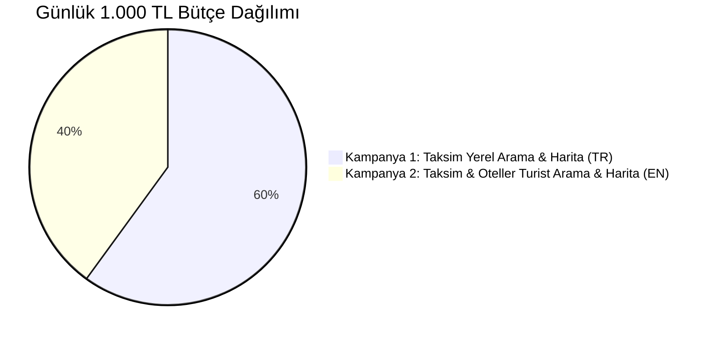

# Tarihi Van Kahvaltı Evi 1978 — Google Ads Strateji Rehberi

**Canlı hesap güncellemesi:** 28 Eylül 2026. Aşağıdaki kampanya örneklerinin bazı eski teklif, zaman ve hedefleme alanları güncel hesabı yansıtmayabilir; canlı ayar için önce bu bölüm ve son denetim raporu esas alınmalıdır.

Google Ads'te etkin iki Search kampanyasının ortalama günlük bütçeleri TR için **₺600**, EN için **₺400**; toplam **₺1.000/gün**. Bu kampanya bütçelerinin toplamıdır, harcama hedefi veya mutlak günlük fatura üst sınırı değildir. Google çoğu kampanyada tek bir günde ortalama günlük bütçenin iki katına kadar harcayabilir; ay içi ücretlendirme sınırı kampanya başına ortalama günlük bütçe × **30,4** üzerinden hesaplanır. Yeni bütçeler tam bir ay değişmeden kalırsa iki kampanyanın toplam aylık sınırı yaklaşık **₺30.400** olur; günlük toplam sunulan maliyet bazı günlerde **₺2.000'e** çıkabilir. 28 Eylül'de bütçeler ay ortasında değiştirildiği için bu rakam Eylül ayının kalan kısmının faturası/limiti değildir; Google ay içi sınırı bütçe değişikliklerinin zamanını da hesaba katar. Gerçek harcama daha düşük olabilir. [Google Ads harcama sınırları](https://support.google.com/google-ads/answer/10486637?hl=tr), [bütçe değişikliklerinin etkisi](https://support.google.com/google-ads/answer/10487143?hl=tr). Satış, rezervasyon veya kâr garantisi çıkarılamaz; bunlar işletme kayıtlarıyla ayrıca ölçülmelidir.

**Canlı teklif durumu:** İki Search kampanyası da 27 Eylül'de üst sonuç alanında %70 hedefli **Hedef Gösterim Payı** teklifine alındı; TR azami TBM ₺25, EN azami TBM ₺30. Her ikisi Ads panelinde öğrenme aşamasında. Strateji görünürlük hedefler, rezervasyon ya da kârlılık hedeflemez. Değişiklikleri sık sık üst üste bindirmeyin; en az 14 gün boyunca harcama, nitelikli talep ve teyitli masa kaydını izleyip sonra teklif hedefine karar verin. Aşağıdaki eski "Tıklama Sayısını En Üst Düzeye Çıkarma" ve TBM örneklerini canlı ayar olarak kullanmayın.

**Canlı kampanya durumu:** Search kampanyaları etkin; ana `Genel Trafik Reklam` ve `PMAX | Yerel Ziyaret | Beyoğlu Test` kampanyaları duraklatıldı. TR/EN Search kampanyalarında Google Arama Ağı açık, Görüntülü Reklam Ağı ve Arama Ağı iş ortakları kapalı. Konum öğesi bağlı. Bu durum Haritalar'da reklam gösterimini garanti etmez.

**Google Haritalar gerçeği:** Google Ads'te yalnızca Haritalar'da yayın yapan özel bir kampanya türü veya belirli arama/harita sırasını garanti eden ayar yoktur. Arama kampanyaları, uygun bir İşletme Profili konum öğesiyle Google Arama ve uygun Maps yüzeylerinde gösterilmeye aday olabilir; gösterim açık artırma ve kullanıcı bağlamına bağlıdır. Maksimum Performans farklı Google kanallarında dağıtım yapar; Search dışı kanalları tamamen kapatmak istiyorsanız PMax kullanmayın. Organik Haritalar sıralaması da reklam bütçesiyle satın alınamaz.

---

## 🛑 KESİN KURALLAR (SIFIR ÇÖP TRAFİK)

| Kampanya tercihi | Gerçekçi hedef |
| :--- | :--- |
| Search ağı tercih ediliyorsa yalnızca Search kampanyası kullanın; Display ve Search iş ortaklarını kapalı tutun. | Yerel niyetli Google aramalarında görünürlük ve nitelikli site/rezervasyon talebi |
| YouTube, uygulama içi ve Display teslimatını bütçe hedefiyle uyumsuz buluyorsanız PMax'i çalıştırmayın. | Konum öğesiyle Maps yüzeylerinde uygun açık artırmalara aday olma; yerleşim garantisi yoktur. |
| Telefon, yol tarifi ve web sitesi tıklamasını ayrı raporlayın. | Gerçek rezervasyon, gelen müşteri ve satışları işletme kayıtlarıyla doğrulama |
| Search Partners kapalı olabilir; bu, Maps görünürlüğünü tek başına kapatmaz. | Organik sıralama için Google Business Profile ve teknik/içerik SEO çalışması |

---

## 💰 BÜTÇE DAĞILIMI (GÜNLÜK TOPLAM ₺1.000 TL)


```mermaid
pie title Günlük 1.000 TL Bütçe Dağılımı
    "Kampanya 1: Taksim Yerel Arama & Harita (TR)" : 600
    "Kampanya 2: Taksim & Oteller Turist Arama & Harita (EN)" : 400
```

* **Kampanya 1 (Yerli - TR):** **₺600 / gün** (Taksim, Beyoğlu, Cihangir, Şişli, Beşiktaş).
* **Kampanya 2 (Turist - EN):** **₺400 / gün** (Taksim & Sultanahmet otellerindeki yabancılar).
* **Aylık bütçe hesabı:** Google'ın ortalama günlük bütçe uygulamasında çoğu kampanyanın aylık sınırı ortalama günlük bütçe × 30,4'tür. ₺1.000/gün toplamı sabit kalırsa yaklaşık ₺30.400 planlayın. Kampanyaların ayrı günlük limitleri olduğundan bazı günlerde iki kampanya toplamı ₺2.000'e kadar harcayabilir; aylık sınır her kampanya için ayrı hesaplanır. Hesap bütçe raporundaki güncel limitleri izleyin.

---

## 📍 GOOGLE HARİTALAR (MAPS) REKLAMI NASIL ÇALIŞIYOR?

1. **Google İşletme Profili (Google Business Profile) Entegrasyonu:**
   - Hesabınızda `Tarihi Van Kahvaltı Evi 1978` (Zambak Sk. No:8) profili **Konum Öğesi (Location Asset)** olarak bağlıdır.
2. **Maps uygunluğu (gösterim garantisi değildir):**
   - Bağlı ve doğru bir konum öğesi, Arama reklamlarını Maps'in uygun reklam yüzeylerine aday kılabilir. Gerçek gösterim; sorgu, açık artırma, yakınlık, bütçe, teklif ve diğer uygunluk koşullarına bağlıdır.
   - Reklam etkileşimi yol tarifi veya arama tıklaması yaratabilir; bunlar gelen müşteri, rezervasyon veya satışla aynı şey değildir.
3. **Sıfır Video / Oyun Riski:**
   - Search kampanyası Display ve Search Partners kapalı ayarlanabilir. Bu ayar YouTube/oyun yerleşimlerini açmaz; ancak Search reklamlarının yalnızca Maps'te çıkacağı anlamına da gelmez. PMax kullanılırsa birden fazla kanal devreye girebilir.

---

## 🚫 PAYLAŞILAN NEGATİF ANAHTAR KELİME LİSTESİ

27 Eylül 2026 Ads değişiklik geçmişinde, 262 terimli paylaşılan listenin üç etkin kampanyaya bağlı olduğu doğrulandı. Bu rehberdeki örnekler canlı listenin tam dökümü değildir; canlı ekleme/silme kararından önce Ads'teki liste ve kampanya bağlantılarını kontrol edin. Kampanyaya özel negatif kelimeler de bulunabilir.

### A. Şehir / Ulaşım / Coğrafi Karışıklıklar
```text
van otobüs bileti
van uçak bileti
van otelleri
van pansiyon
van gölü
van kedisi
van kalesi
van ekspresi
van ferit melen havalimanı
van valiliği
van belediyesi
van üniversitesi
van yüzüncü yıl
van hava durumu
van harita
van kiralık daire
van satılık ev
van haberleri
van nöbetçi eczane
van otogarı
van merkez
van edremit
van ipekyolu
van tuşba
van erciş
van başkale
van muradiye
van özalp
van saray
van çaldıran
van bahçesaray
van gürpınar
van çatak
```

### B. Uzak İlçeler / Şehir Dışı
```text
kadıköy
anadolu yakası
üsküdar
kartal
maltepe
pendik
tuzla
ataşehir
ümraniye
çekmeköy
beykoz
şile
sancaktepe
sultanbeyli
bakırköy
florya
yeşilköy
avcılar
beylikdüzü
esenyurt
büyükçekmece
küçükçekmece
başakşehir
bağcılar
bahçelievler
güngören
zeytinburnu
esenler
bayrampaşa
gaziosmanpaşa
sultangazi
eyüpsultan
sarıyer
arnavutköy
çatalca
silivri
izmir
ankara
bursa
antalya
eskişehir
adana
trabzon
kocaeli
sakarya
tekirdağ
edirne
```

### C. Tarif & Evde Yapım & Alakasız
```text
tarifi
tarifleri
nasıl yapılır
nasıl pişirilir
evde yapımı
malzemeleri
içindekiler
kalori
faydaları
zararları
tarihçesi
nedir
kimdir
vikipedi
wikipedia
ekşi sözlük
youtube
video izle
fotoğrafları indir
resimleri
çizimi
vektörel
png
logo
vektör
iş ilanları
iş başvurusu
garson arayanlar
komi arayanlar
aşçı arayanlar
eleman arayanlar
maaşları
iş başvurusu yap
franchise
bayilik
devren satılık
kiralık
sahibinden
toptan
bayilik şartları
```

---

## 🇹🇷 1. KAMPANYA: Taksim & Çevresi Yerel Arama ve Harita (TR)

* **Kampanya Türü:** Sadece Arama Ağı (Search)
* **Ağlar:** Google Arama Ağı (Görüntülü Ağ: **KAPALI**, Arama Ortakları: **KAPALI**)
* **Günlük Bütçe:** **₺600,00 / gün**
* **Canlı hedef konum:** Beyoğlu, Beşiktaş, Fatih ve Şişli; Van hariç. Yarıçap hedeflemesi değil.
* **Canlı teklif:** Hedef Gösterim Payı, üst sonuç alanı %70, azami TBM ₺25; öğrenme aşamasında. Bu görünürlük odaklıdır; rezervasyon verimliliğini garanti etmez.
* **Zaman planı:** 27 Eylül'de reklam zaman planı değiştirildi. Saat/gün listesini Ads kampanya ayarlarından doğrulamadan bu rehberdeki eski saatleri kullanmayın.

### Örnek anahtar kelime temaları

Bu liste öneri havuzudur; canlı etkin kelimelerin tam dökümü değildir. Arama terimleri ve nitelikli rezervasyon kayıtlarıyla doğrulamadan topluca eklemeyin.
```text
[taksim van kahvaltısı]
[taksim kahvaltı mekanları]
[beyoğlu van kahvaltı evi]
[cihangir serpme kahvaltı]
"taksim kahvaltı"
"taksim kahvaltı yerleri"
"beyoğlu kahvaltı mekanları"
"cihangir kahvaltı mekanı"
"taksim serpme kahvaltı"
"istanbul van kahvaltı evi"
"tarihi van kahvaltı evi"
"istiklal caddesi kahvaltı"
"taksim bal kaymak"
"beyoğlu serpme kahvaltı"
"van kahvaltısı cihangir"
```

### Reklam Metinleri
* **Başlıklar:**
  1. *Tarihi Van Kahvaltı Evi 1978*
  2. *Taksim'de Gerçek Van Sofrası*
  3. *Zambak Sokak'ta Tarihi Mekan*
  4. *Hakiki Karakovan Balı & Kaymak*
  5. *Otlu Peynir, Murtuğa & Kavut*
  6. *Tarihi Rum Binasında Kahvaltı*
  7. *Zengin Serpme Van Kahvaltısı*
* **Açıklamalar:**
  1. *1978'den bu yana tarihi Rum binasında otlu peynir, hakiki bal-kaymak ve sıcak murtuğa lezzeti.*
  2. *Taksim Zambak Sokak'ta zengin serpme Van kahvaltısı. Semaver çayı ve yöresel tatlar sizi bekliyor.*

---

## 🌍 2. KAMPANYA: Taksim & Oteller Tourist Breakfast & Maps (EN)

* **Kampanya Türü:** Sadece Arama Ağı (Search)
* **Ağlar:** Google Arama Ağı (Görüntülü Ağ: **KAPALI**, Arama Ortakları: **KAPALI**)
* **Günlük Bütçe:** **₺400,00 / gün**
* **Canlı hedef konum:** Beyoğlu, Beşiktaş, Fatih ve Şişli. Turist niyeti bu coğrafyayla tek başına garanti edilmez.
* **Canlı dil:** İngilizce. İstanbul'daki ziyaretçilerin kullandığı arayüz dili farklı olabileceğinden dil kısıtını ayrıca test edin.
* **Canlı teklif:** Hedef Gösterim Payı, üst sonuç alanı %70, azami TBM ₺30; öğrenme aşamasında. Bu görünürlük odaklıdır; rezervasyon verimliliğini garanti etmez.
* **Zaman planı:** 27 Eylül'de reklam zaman planı değiştirildi. Saat/gün listesini Ads kampanya ayarlarından doğrulamadan bu rehberdeki eski saatleri kullanmayın.

### Örnek anahtar kelime temaları

Bu liste öneri havuzudur; canlı etkin kelimelerin tam dökümü değildir. Arama terimleri ve nitelikli rezervasyon kayıtlarıyla doğrulamadan topluca eklemeyin.
```text
[best turkish breakfast taksim]
[authentic van breakfast istanbul]
[traditional turkish breakfast istanbul]
[turkish breakfast near me]
"best breakfast in taksim"
"turkish breakfast beyoglu"
"breakfast places near taksim"
"authentic turkish breakfast istanbul"
"van breakfast house istanbul"
"bal kaymak taksim"
"traditional breakfast near istiklal"
"best kaymak in istanbul"
```

### Reklam Metinleri (EN)
* **Başlıklar:**
  1. *Authentic Van Breakfast 1978*
  2. *Best Turkish Breakfast Taksim*
  3. *Historic Greek Building Setting*
  4. *Fresh Clotted Cream & Honey*
  5. *Traditional Van Spread Since 1978*
  6. *2 Mins from Taksim Square*
  7. *Local Cheeses & Warm Dishes*
* **Açıklamalar:**
  1. *Experience legendary authentic Van breakfast in a historic 19th-century Greek building near Taksim.*
  2. *Authentic herbal cheeses, hot murtuga, honeycomb with rich kaymak & fresh Turkish tea since 1978.*

---

## 🔗 REKLAM UZANTILARI (ASSETS)

1. **Site Bağlantıları (Sitelinks):** Hesap düzeyinde `Canlı Menü & Fiyatlar`, `Serpme Van Kahvaltısı`, `Yol Tarifi & Konum` ve `1978 Lezzet Tarihimiz` bağlantıları var. 28 Eylül'de TR Search'e `Masa Rezervasyon Talebi` (`/rezervasyon`), EN Search'e `Request a Table` (`/en/rezervasyon`) kampanya bağlantıları eklendi. İkisi de Google Ads'te **İnceleniyor** durumunda; onaylanana kadar yayında olduklarını varsaymayın.
2. **Açıklama Metinleri (Callouts):**
   - *1978'den Beri*
   - *Tarihi Rum Binası*
   - *Otlu Peynir & Murtuğa*
   - *Hakiki Bal & Kaymak*
   - *Sınırsız Semaver Çayı*
   - *Taksim Zambak Sokak'ta*
3. **Telefon ve Konum Butonu:**
   - `+90 541 525 2868` & Google Maps Konum Pin Bağlantısı

---

## Canlı değişiklik kaydı — 28 Eylül 2026

- `SEARCH | TR | Yerel | Taksim` ortalama günlük bütçesi ₺600; `SEARCH | EN | Turistler | Taksim` ₺400 yapıldı. İki PMax kampanyası duraklatıldı. Ads panelinde etkin kampanyaların toplamı ₺1.000/gün.
- Search teklif stratejileri Hedef Gösterim Payı olarak korundu; TR %70 / azami TBM ₺25, EN %70 / azami TBM ₺30 ve öğrenme aşamasındalar. Bütçe değişikliği sonrası kısa dönem sonuçları kârlılık kanıtı saymayın.
- TR ve EN kampanyalarına rezervasyon talebi sitelink'i eklendi; ikisi de Google incelemesinde. Bu linkler masa teyidini garanti etmez.
- Bu hesap değişikliklerinin gerekçesi, ölçüm kısıtları ve Ads paneli bulguları için `../google-ads-denetim-2026-09-28.md` içindeki “Uygulanan düzeltmeler” bölümüne bakın.
