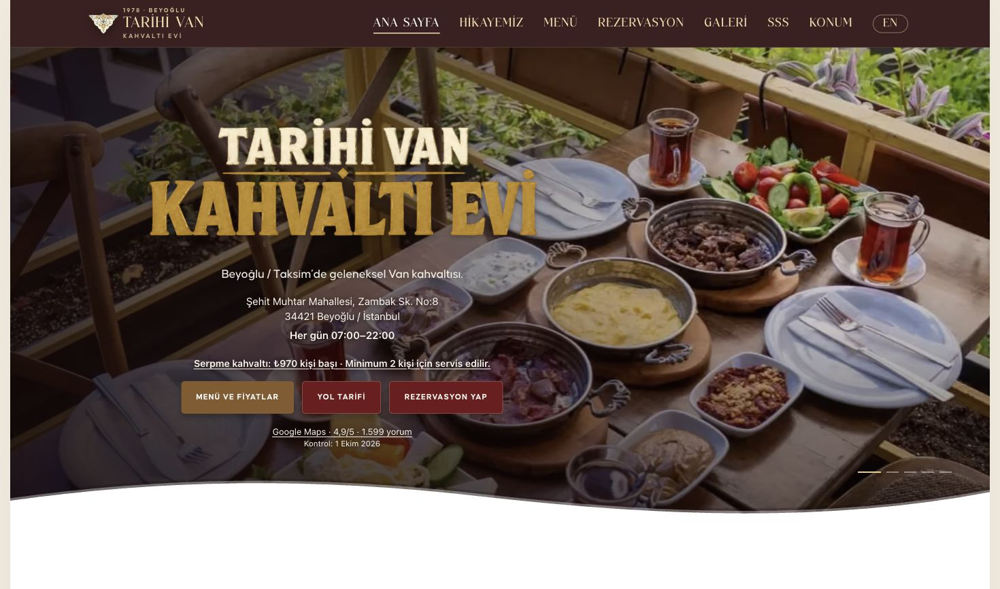
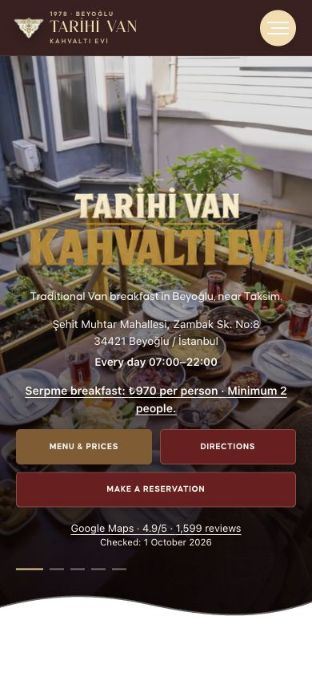
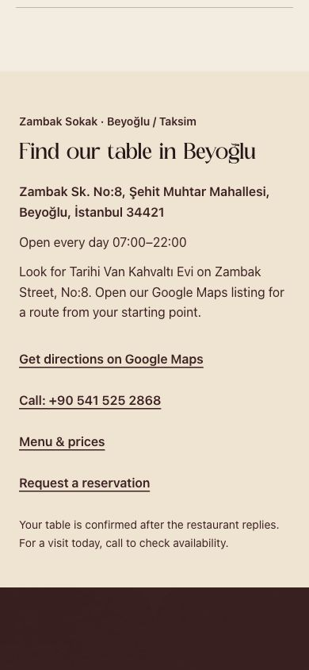
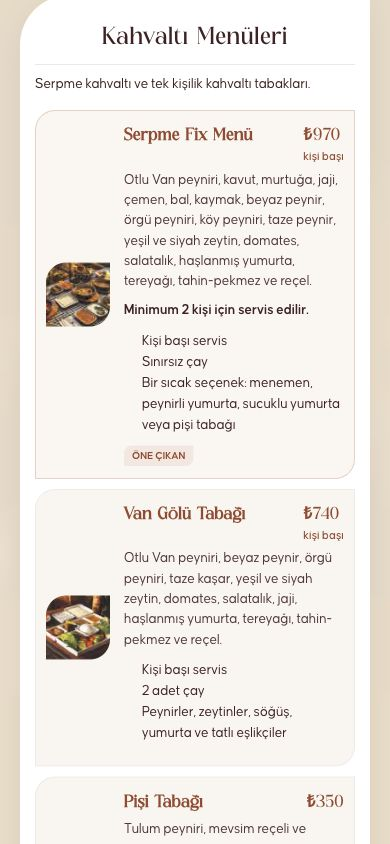
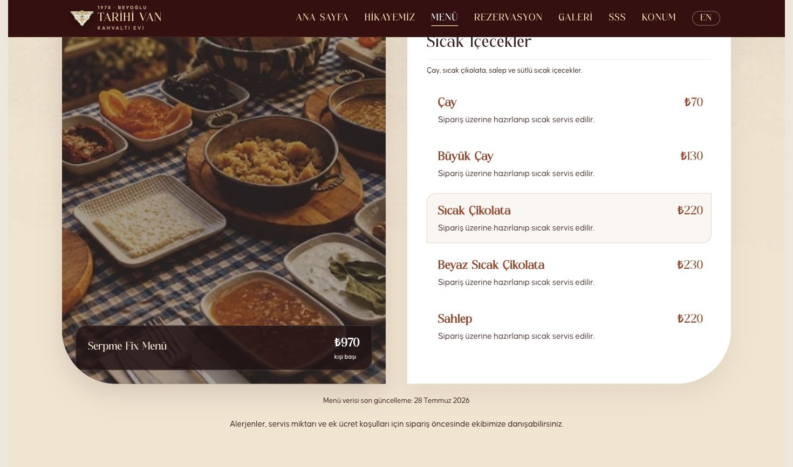

# Bölüm 1 — Uygulama ve doğrulama kaydı

Tarih: 1 Ekim 2026, Europe/Istanbul. Kapsam: 30 sayfalık SEO/GEO raporunun ilk uygulama bölümü. Tam öneri eşlemesi ve araştırma kaynakları [beş aşamalı planda](rapor-analizi-ve-bes-asamali-plan-2026-10-01.md), dosya kapsamı [kod envanterinde](kod-envanteri-2026-10-01.csv) bulunur.

## Teslim edilen davranış

- Türkçe ve İngilizce ana sayfanın ilk ekranında açık adres, 07:00–22:00 saatleri, doğrudan Maps, menü/fiyat ve rezervasyon bağlantıları bulunur. Saat bilgisi mevcut merkezi işletme verisinden gelir; bütün özel günler için ayrı saha doğrulaması değildir.
- Serpme Fix Menü fiyatı ana sayfaya menüyle aynı kaynaktan gelir. Mevcut 970 TL kişi başı fiyatı ve minimum iki kişi kuralı işletme yanıtıyla doğrulandı. Ayrı sabit ana sayfa fiyatı yazılmadı.
- Maps özeti 4,9/5 ve 1.599 yorumdur; doğru işletme CID’si, kaynak bağlantısı ve 1 Ekim 2026 gözlem tarihi görünür. Bu sayılar canlı otomatik senkronizasyon değildir. Restaurant şemasına self-serving AggregateRating eklenmedi.
- İngilizce LOCATION ve rezervasyonun adres bağlantısı artık gerçek İngilizce `/en#location` bölümüne gider. Adres, saat, telefon, Maps ve talep/onay ayrımı bu bölümde okunabilir.
- Menüdeki 142 ürün ve 18 kategori Türkçe/İngilizce başlangıç HTML’inde bulunur. Kategori tıklaması ürün oluşturmaya değil, var olan bölüme gider. Ürün fragmentleri gerçek kartları hedefler.
- Kişi başı notu, minimum kuralı ve menü verisinde zaten bulunan dahil ürünler görünür hale getirildi. Mobil açıklamalar iki satırda kesilmez. Menü verisinin gerçek son güncelleme tarihi korunur.
- Menü kaydından sonra iki menüdeki kartlar/şema ve iki ana sayfadaki fiyat aynı veriyle yenilenir. Yeni kategori ve ürün de görünür olur.
- Skip link odaklanabilir `main-content` hedefini bulur. Ürün detayları klavyeyle açılır; modalda Tab odağı tutulur, Escape kapatır ve odağı tetikleyiciye döndürür.
- Yorum kaynağına tıklamak `review_source_click` üretir; yol tarifi dönüşümü olarak sayılmaz.
- Sitemap menü verisindeki yalnız tarih bilgisine öğlen saati uydurmaz. Ana sayfanın fiyat kaynağı değişirse lastmod da bu kaynağı takip eder; ilgisiz sayfalar bugüne çekilmez.

## Otomatik doğrulamalar

| Kontrol | Sonuç | Gerçekte doğruladığı şey |
| --- | --- | --- |
| `npm run lint` | Geçti | ESLint hatası/uyarısı yok. İki eski kullanılmayan import da temizlendi. |
| `npm run build` | Geçti | Next 16.3.5 üretim derlemesi ve TypeScript başarılı. TR/EN home/menu statik prerender edilir, cache 1 dakika revalidate / 5 dakika expire. |
| `npm run test:menu` | Geçti | 142 ürün/18 kategori; derleme HTML’inde gerçek kartlar; gizli streaming bloğu olmaması; iki dilde fiyat/şema/birim; minimum ve çay bilgisi. |
| Menü yönetim regresyonu | Geçti | Yetkisiz POST 401; izole yetkili kayıt sonrası 970 → 971 test fiyatı, 143. ürün ve 19. kategori dört ilgili sayfada güncel. Sonra baseline geri yüklenir. |
| Sitemap tarih regresyonu | Geçti | Bugünün menü veri tarihiyle kayıt sonrası sitemap gelecekte lastmod üretmez. |
| `npm run test:seo` | Geçti | 30 kanonik URL’nin yanıt/metadata sözleşmesi; 48 eski URL yönlendirmesi; canonical/hreflang/sitemap/robots/IndexNow/şema/404 ve yerel medya kontrolleri. |
| `npm run test:reservations` | Geçti | Mevcut rezervasyon regresyonları, yerel izole saklama ve hata senaryoları. Canlı rezervasyon kaydı yazılmadı. |
| `git diff --check` | Geçti | Değişikliklerde whitespace hatası yok. |

SEO testinin “indekslenebilir” çıktısı, teknik koşulların kontrolüdür; Google’ın gerçekten indekslediğini, canonical seçimini veya organik sıralamayı kanıtlamaz. Rezervasyon testinin kasıtlı depolama hatası senaryoları beklenen başarısız HTTP yanıtlarını da kontrol eder.

Menü testinin fiyatı ve ek ürünleri geçici yerel dosyadadır. Kendi loopback sunucusu ve rastgele test oturumu kullanılır; Supabase bağlantısı kapalıdır. `INDEXNOW_DRY_RUN=1` sayesinde deneme verileri IndexNow’a gönderilmez. Git’teki menü JSON’u, gerçek ürün fiyatları ve canlı rezervasyon verisi değiştirilmedi. Normal üretim yönetim kaydında IndexNow bildirimi çalışmaya devam eder.

Son üretim derlemesinde, ortamda tanımlı Supabase kaydının eksik olduğu uyarısı görüldü ve uygulamanın mevcut bundled-menu geri dönüşü kullanıldı. Fiyat değişikliği testleri bu dış kayda dayanmadı. Canlı Supabase veri bütünlüğü, bütün fiyatların işletme teyidiyle yapılacak ikinci bölümde ayrıca kontrol edilmelidir.

## Tarayıcı ve görsel doğrulama

Üretim derlemesi Chrome’da incelendi. Boyutlar yalnız talep edilmedi; gerçek `innerWidth` ile de kontrol edildi.

| Görünüm / etkileşim | Gözlenen sonuç |
| --- | --- |
| TR ana sayfa 320 × 812 | Yatay taşma yok; adres, saat, fiyat/birim/minimum ve üç eylem ilk ekranda okunabilir. |
| EN ana sayfa 390 × 844 | Yatay taşma yok; canlı fiyat ve İngilizce ticari notlar görünür. |
| TR masaüstü 1470 × 867 | Adres, saat, fiyat ve kaynaklı değerlendirme ilk ekranda; marka kompozisyonu korunur. |
| TR menü 390 × 844 | 142 kart/18 kategori DOM’da; kişi başı, minimum, sınırsız çay ve sıcak seçenek ilk ürün kartında görünür; açıklama kesilmez. |
| EN mobil LOCATION | Mobil menüde doğru EN href; İngilizce bölüm sabit başlığın altında görünür; footer son satırı örtmez. |
| Skip link + Enter | `document.activeElement.id === "main-content"`; hedef gerçekten odaklanır. |
| Ürün + Enter / Shift+Tab / Tab / Escape | Dialog açılır; ilk/son odak çevrimi dialog içinde; kapatma sonrası ürün düğmesine dönülür. |
| Script içermeyen TR/EN menü fixture’ı | 0 script, 142 kart, 18 kategori; doğal kategori bağlantısı `#sicak-icecekler` hedefini bulur; yatay taşma yok. |

Script içermeyen fixture, yerel üretim yanıtından bütün script etiketleri çıkarılarak yalnız HTML/CSS ve medya ile gösterildi. Chrome’un genel JavaScript ayarları değiştirilmedi. Bu, ürün içeriğinin ve kategori bağlantılarının site JavaScript’i olmadan okunabilirliğini gösterir; modal etkileşiminin scriptsiz çalışacağı iddiası değildir. Ayrıca `.next/server/app/menu.html` ve `en/menu.html` doğrudan ayrı test edildi.

### Masaüstü ana sayfa

### Dar mobil ekran

### İngilizce ana sayfa ve konum

### Görünür menü ve scriptsiz kategori geçişi

## Ölçüm başlangıcı ve açık sınırlar

Search Console organik ve Generative AI raporlarından yayımdan önce salt okunur başlangıç gözlemi alındı. Kesin sayılar ve sorgu/sayfa dökümleri **Git deposu dışında** yerel özel notta tutuldu. Kamuya açık bu belgeye hesap kimliği veya özel analitik sayılar eklenmedi. AI görünürlüğü sıfır değil; sonuç karşılaştırması aynı tarih/ülke/cihaz ve metrik tanımıyla yapılmalı.

İlk bölüm, beş aşamalı planın yazılımla uygulanabilir başlangıç kapsamını tamamlar. Servis/kuver, tek kişi koşulları, dahil içeceklerin güncel mutfak teyidi, tedarik/alerjen ve tarih kanıtı ikinci bölümde açıktır. Şimdilik ücretsiz su/kahve veya ek ücretten bağımsız kesin iki kişilik toplam yayımlanmadı. Kök HTML dil düzenlemesi, performans saha ölçümü, dış profiller ve sonuç ölçümü sonraki bölümlerdedir.

GitHub `main` gönderimi ile hosting’in canlıya alması ayrı işlemlerdir. Gönderim sonucu ve canlı dağıtım gözlemi teslim mesajında ayrıca belirtilir; buradaki ekranlar yerel üretim derlemesinin kanıtıdır.
